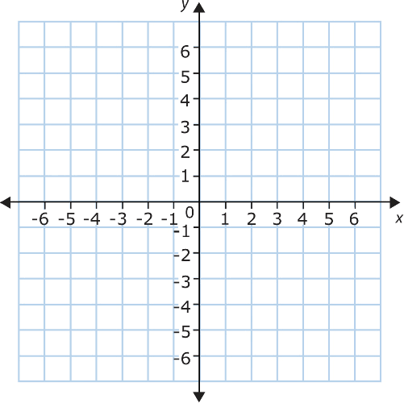

# Mapwize Georeference for JavaScript

Library to work with georeference and project and unproject points between x/y and latitude/longitude WGS84 coordinates.

## Georeference

A georeference is an array of at least 2 objects with format like

```json
{
    "points": [
        {
            "x": 1310.2132295719841,
            "y": 1406.1883268482486,
            "latitude": 50.63264941120241,
            "longitude": 3.0202874193832945
        },
        {
            "x": 0,
            "y": 0,
            "latitude": 50.63261391508114,
            "longitude": 3.0206033053400465
        }
    ]
}
```

where `x` and `y` are the coordinates of a point in the local coordinate system and `latitude ` and `longitude ` are the world coordinates of the same point.

**This library expects the x/y coordinates system to be orthonormal!** This means:

- The `x` axis is horizontal, increasing to the right
- The `y` axis is vertical, increasing to the top
- One unit on the `x` and `y` axis correspond to the same distance in the phycical world

**Please note that for pixels in images, the `y` axis is often pointing downwards. You need to count the pixels from the bottom-left of the image for this library to work.**



## Projections

Methods are available to project coordnates and GeoJSON features from `x/y` to `latitude/longitude` coordinates and vice-versa.

```
projectPointForGeoreference = function(point, georeference) 
projectFeatureForGeoreference = function(feature, georeference)
unprojectLatLngForGeoreference = function(latLng, georeference)
unprojectFeatureForGeoreference = function(feature, georeference)
```

`point` and `latLng` are an array of 2 numbers like `[0, 0]`.

`feature` is a GeoJSON feature.

## Tests

Some tests are available in the `tests` directory and give some details on how to use the library.

You can run them using:

```bash
npm run test
```
